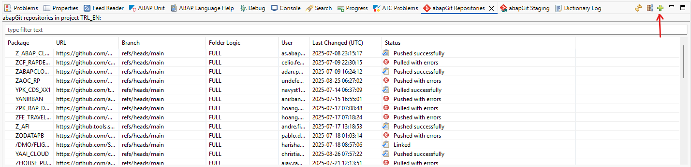
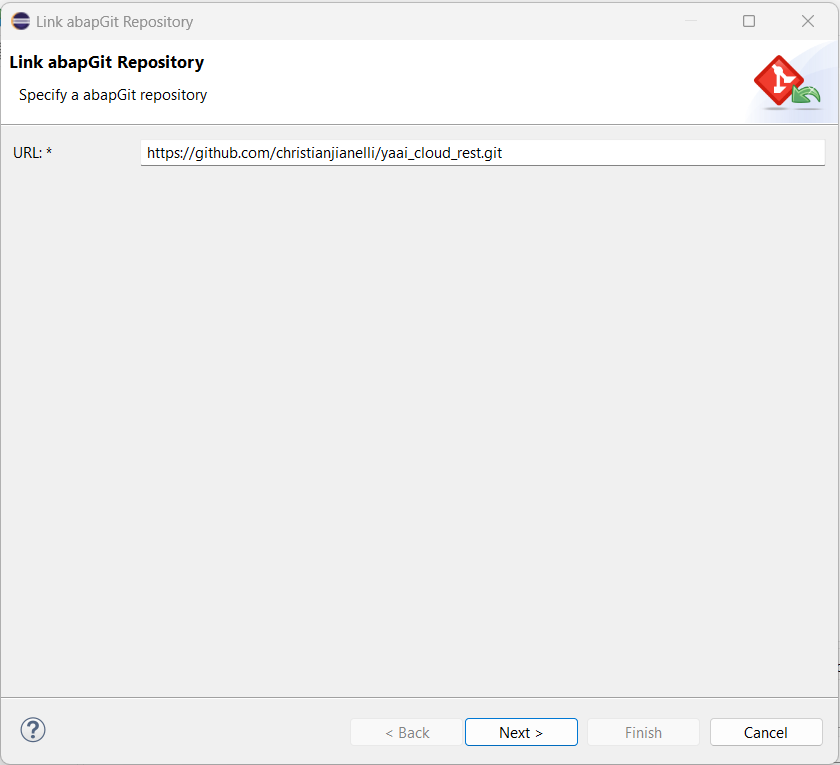
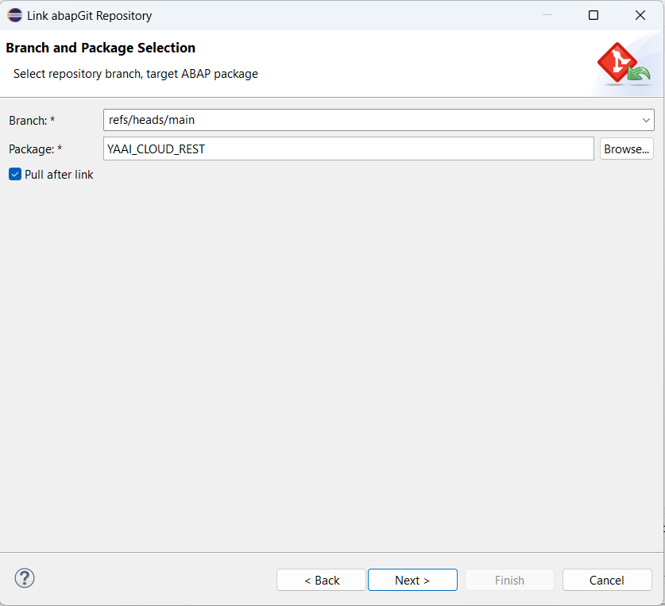
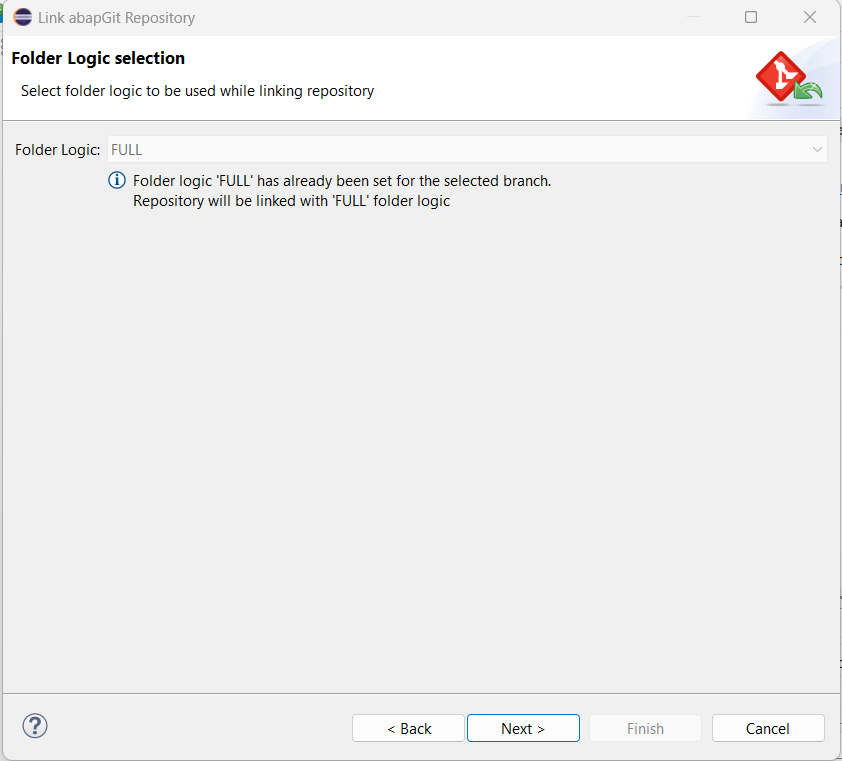
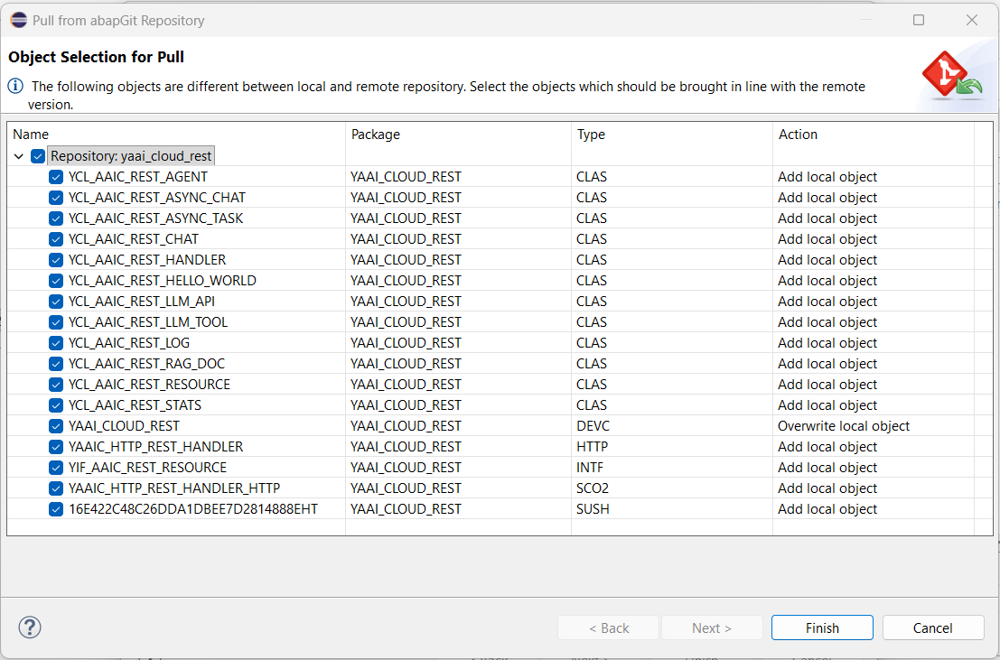
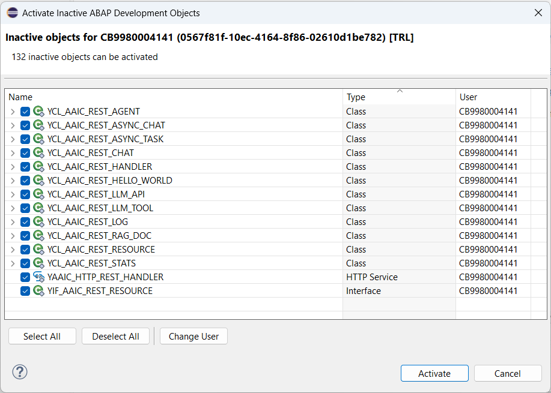

# yaai_cloud_rest - ABAP AI tools Cloud REST API
This repository contains the REST API required to run the [ABAP AI tools Cockpit](https://github.com/christianjianelli/yaai_cloud_cockpit). The Cockpit frontend requires this API to function.

## Installation
You can install the ABAP AI tools Cloud REST API into your ABAP Cloud system using abapGit. The BTP ABAP environment comes with a preinstalled official SAP distribution of abapGit.

**Steps:**
1. Create a package named `YAAI_CLOUD_REST`;

2. Open the abapGit Repositories view and click the button with the plus sign (Link new abapGit Repository...):

   

3. Enter the URL `https://github.com/christianjianelli/yaai_cloud_rest.git`:

   

4. Specify the package:

   

5. Click the **Next** button:

   

6. Select all object and click the **Finish** button:

   

7. Activate the imported objects as needed.

   

You have now successfully installed the `ABAP AI tools Cloud REST API`.